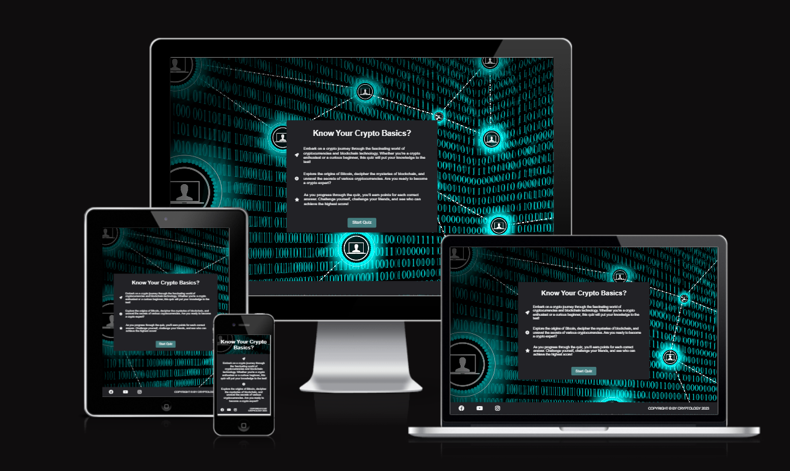

# know-your-crypto-basics
## Code Institute - Second Milestone Project: JavaScript Essentials.

Welcome,

Know Your Crypto Basics is a fun and interactive online quiz about cryptocurrency fun facts and fundamentals. The user can test his/hers general knowledge and see where there are still gaps to fill.

# Table of Contents
- [Know Your Crypto Basics](#know-your-crypto-basics)
  - [Code Institute - First Milestone Project: User Centric Frontend Development.](#code-institute---second-milestone-project-javascript-essentials)
- [Table of Contents](#table-of-contents)
  - [Demo](#demo)
    - [A live demo to the website can be found here](#a-live-demo-to-the-website-can-be-found-here)
  - [UX](#ux)
  - [User stories](#user-stories)
    - [Strategy](#strategy)
    - [Scope](#scope)
    - [Skeleton](#skeleton)
    - [Surface](#surface)
  - [Technologies](#technologies-used)
  - [Features](#features)
    - [Existing Features](#existing-features)
    - [Features Left to Implement](#features-left-to-implement)
  - [Testing](#testing)
    - [Validator Testing](#validator-testing)
    - [Bugs](#bugs)
  - [Deployment](#deployment)
  - [Credits](#credits)
    - [Content](#content)
    - [Media](#media)
    - [Acknowledgements](#acknowledgements)

## Demo

### A live demo to the website can be found [here](https://equaynor.github.io/know-your-crypto-basics/)

## UX
Ther user group targeted by this website are people interested in cryptocurrencies.
The site is focused on simplicity and a fun experience.

## User stories
The following points are applicable to the users:

1. play a fun quiz
2. navigate easily around the application
3. clearly see what question number I am on
4. answer reasonably challenging questions on the topic
5. see immediately if my answer is right or wrong
6. view my final score
7. easily restart the game after I finish
8. be rated on my knowledge of the subject
9. be able to use the application on different sized screens

As a new user I want to 
* easily identify what the quiz topic is

During this phase of the project design test repositories were created to try out visuals and initial features before establishing the final respository.

### Strategy
The purpose of this online quiz is to provide an entertaining online quiz for people of all ages who are interested in cryptocurrencies. 

The quiz should be easy for the user to navigate across the different pages and return to restart the quiz. 

The application should initially be a simple design with enough interactivity to function and entertain and to which features and question content can easily be added as popularity grows. 

### Scope
The project scope follows the minimal viable features approach for the initial project. However the scope is such that interactive features to enhance the user experience can be added in future. 

The project is to be a simple functioning online quiz game with randomly generated multiple choice questions. The score will accumulate up to a specified maximum which can be adjusted according to the number of questions available. Initially this will be set to 15 as the test pool of questions is relatively small but sufficient for the user to enjoy the experience. 

The purpose of the site will be clear from the landing page and will be visually attractive to the user. The site will be easy to navigate and fully responsive to all sized screens.

### Skeleton
The website is designed to be clear and simple. And the site has a two areas.

**Website Areas:**

1. **_Main-Content-Box:_** First an introduction to the quiz.Then the area that displays questions and answers. Lastly displays the score.
2. **_Footer:_** Social media links and copywriting information.

**Wireframe**
The wireframe is designed using Balsamiq software. Initially the website was supposed to always show the current score level, but given the limited time left and the approaching deadline this is still to be added.

My wireframe design in the [(pdf format)](./assets/readme-assets/wireframe.pdf)

### Surface
* **Background Image**
The background image displays blockchain technology.

[Background Image](./assets/images/bockchain-network-background.webp)

* **Color Scheme**
I have selected to go with a modern crypto inspired color scheme.

## Features
### Existing Features

* **Welcome Screen**
  * Three keypoint to let the user know what the quiz is about and encourage to play. 
  * A button to start the quiz

* **Question Screen**
  * Displays a shuffled question.
  * Displays four answer options
  * Highlights chosen answer if wrong in red and if right in green.

* **Final Score Screen**
  * Displays users final score.
  * Displays a button to restart the quiz.

* **Footer**
* Includes the (dummy) social media links and copywrite info.

### Features Left to Implement
Future features to add to improve the user interface would be:
* More questions to test general knowledge thouroughly.
* A current score counter.
* A final message depending on the score.
* The ability to save the user name and high scores so the user could return to the quiz to beat their own scores. 
* A navigation menu along with the future features to enable the user to directly access their high scores
* Picture- and graph-based question to add variety.

## Technologies Used
### Languages
- HTML
- CSS
- JavaScript

### Frameworks & Tools
- Git
- GitHub
- VSCode
- Balsamiq
- Font Awesome
- TinyWow
- Leonardo.ai
- JSHint
- Lighthouse
- W3C Markup validation service
- W3C Jigsaw CSS validation service 
- WAVE WebAIM web accessibility evaluation tool

## Testing
* I tested the site, and it works in different web browsers: Chrome, Firefox, and Microsoft Edge.
* I confirmed that the site is responsive and functions on different screen sizes using the devtools device toolbar.
* I confirmed that everything is readable and easy to understand.
* I confirmed functionality of buttons, score counting and randomization of questions.

### Validator Testing
* **HTML**
  No errors were returned when passing through the official [W3C validator](./assets/readme-assets/html-validator-result.png)

* **CSS**
  No errors were found when passing through the official [(Jigsaw) validator](./assets/readme-assets/css-validator-result.png)
  
* **Performance**
  Google Lighthouse in Google Chrome Developer Tools was used to test the performance of the website. [Lighthouse DevTools](./assets/readme-assets/lighthouse-score.png)

### Bugs
* **Solved bugs**
| **Bug** | **Fix** |
| ------- | ------- |
| Shuffle function repeating questions | Add selectRandomQuestion function and use askedQuestions array |
| Next button not working | Add event listener |
| Questions container moving with each question | Fix height property |
| Footer overlapping on mobile devices | Turn footer position to fixed |
| Restart button not aligned | Use inline-block property |
  
  
* **Unfixed Bugs**
 - Site is scrolling vertically on mobile devices.

## Deployment
* The site was deployed to Git Hub pages using the following steps:
  * In the Github repository, the Settings tab.
  * Under General, navigate to Code and Automation and select 'Pages'.
  * In the Build and Deployment section for Source, select 'Deploy from a branch' from the drop-down list.
  * For Branch, select 'main' from the drop-down list and Save.
  * On the top of the page, the link to the complete website is provided.
  
  - The deployed site will update automatically upon new commits to the master branch.

## Credits
### Code
Guiding resources and learning references:
* [Bro Code](https://www.youtube.com/watch?v=8dWL3wF_OMw&t=18911s)
* [James Q Quick - Build A Quiz App](https://www.youtube.com/watch?v=rFWbAj40JrQ)
* [Brian Design](https://www.youtube.com/watch?v=f4fB9Xg2JEY)
* [GreatStack](https://www.youtube.com/watch?v=PBcqGxrr9g8&t=1496s)
* [Shuffle function](https://www.educative.io/answers/how-to-shuffle-an-array-in-javascript)
* [w3 schools - multiple queries](https://www.w3schools.com/)
* [stackoverflow - multiple queries](https://stackoverflow.com/)

### Media
* [Background Image](https://www.stockvault.net/photo/241737/block-chain-network-concept-distributed-ledger-technology#)

### Acknowledgements
* Inspirational support from [Ana Runje](https://github.com/4n4ru/CI-P2-GuessingBee/blob/master/README.md) readme file.
* Inspirational support from [Siobhan Gorman](https://github.com/siobhanlgorman/80s-Mixtape-Quiz/blob/master/README.md) readme file.
* To my mentor, Medale Oluwafemi, even though we didn't find time due to illness, his past advice was guiding me.
* To my wife, only her endless support makes this coding journey possible. 